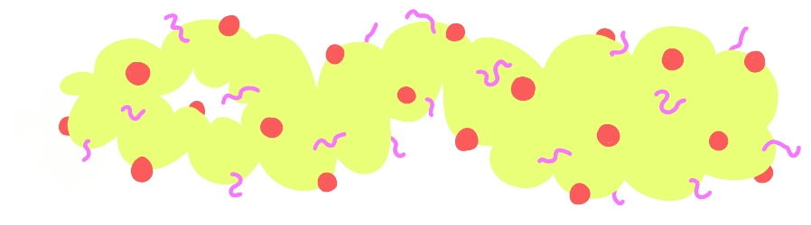

# slugnetbot
> a helloworld botnet client with a web interface

## API Docs
### Install and Run
* `$ npm i -g slugnetbot`
* `$ PORT=<port> SECRET=<secret> DEBUG=true slugnetbot

### Development 
0. clone the repository 
0. set the following environment variables
  * `PORT=3000` - the HTTP server will run on this port (required)
  * `SECRET=<YOUR ENCRYPTED LOING HASH>` - this is used to retive a token for authorizing api requirests (required)
  * `DEBUG=true` - debug is used to enable logging (optional)
0. run `$npm run start`

### Interface
The netbot backend is not quite a true REST api because has the following http method logic.
- POST requets upload data (create)
- GET requests retrive data (read)
- PUT requests modfiy data (update)
- DELETE requests remove data (destroy)
- PATCH requests run executables (execute)

#### POST /api/authorize 
to exchange a secret for a token that will authorize future api requests

#### POST /api/executable
upload an executable file

#### GET /api/executable
retrieve a list of uploaded executables

#### POST /api/task
upload a task configuration

#### PUT /api/task/:id
modify a task configuration 

#### GET /api/task
retrieve a list of tasks

#### PATCH /api/task/:id 
execute a task 

#### PATCH /api/trigger
upload and execute a script without storing it 

## Client Docs
# /landing
# /log
# /task
# /trigger
